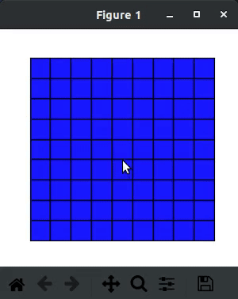
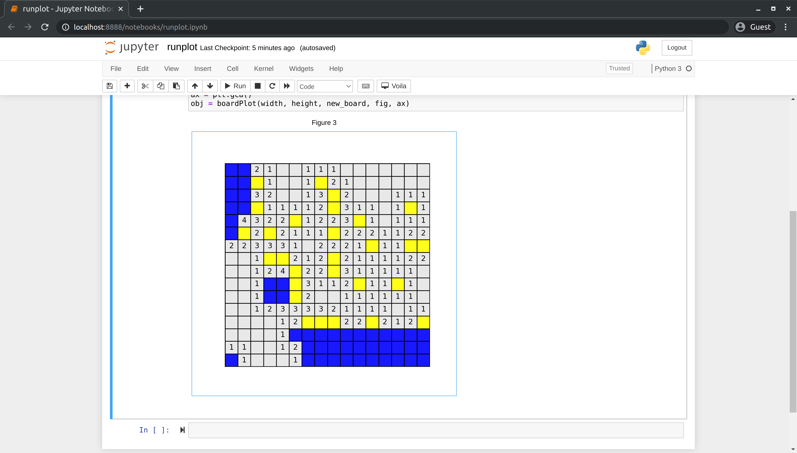
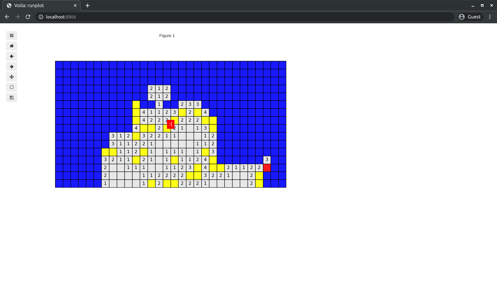

# minesweeper

*TODO:*
- *Build an autosolver*
- *Show timer somewhere*
- *Add widgets to allow for resets and better settings interface*

It's minesweeper in Python! Just a fun little thing I made to really test how well matplotlib is able to handle interactivity. You can control the width, height and number of mines on the board. Standard configurations are:
- Beginner: 8 x 8 with 10 mines
- Intermediate: 16 x 16 with 40 mines
- Advanced: 30 x 16 with 99 mines

Left click to flag tiles (yellow) and auto-expand opened tiles. Right/middle click to open unopened tiles (blue). Timer starts when first tile is opened.

There are a couple ways it can be played:

### 1. In a matplotlib figure
This is probably the easiest way as it only requires Python and matplotlib
    
    $ python boardPlot.py

### 2. In a Jupyter Notebook
This requires all the packages in `environment.yml` so is a bit more of a trek to get set up

    $ jupyter notebook runplot.ipynb

### 3. As a standalone webpage with `voila`
By using `voila`, the notebook can be converted to a webpage that is run on a server (no dependencies on client side)

    $ voila runplot.ipynb

